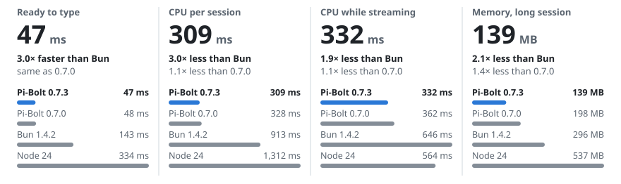

<p align="center">
  <a href="https://github.com/opensec-git/Pi-Bolt">
    
  </a>
</p>
<p align="center">
  <a href="https://github.com/opensec-git/Pi-Bolt/releases/latest"></a>
  <a href="https://www.npmjs.com/package/pi-bolt"></a>
  <a href="https://github.com/earendil-works/pi/releases/tag/v1.0.3"></a>
  <a href="#requirements"></a>
  <a href="#requirements"></a>
  <a href="LICENSE"></a>
</p>

<h1 align="center">Pi-Bolt</h1>

<p align="center"><b>The <a href="https://github.com/earendil-works/pi">Pi</a> coding agent, compiled ahead of time to native code.</b><br>
One executable for Linux x86-64 and macOS on Apple silicon. No JIT, nothing to install alongside it.</p>

Pi-Bolt runs the Pi you already use: its commands, keys, sessions, settings, extensions and providers. What changes is how it
runs. Every function is compiled to machine code when the executable is built, and stored in it with a prebuilt JavaScript heap,
so at launch nothing is parsed, interpreted or JIT-compiled. It starts two to three times sooner than Pi on Bun and uses about a
third of its CPU over a session.

<picture>
  <source media="(prefers-color-scheme: dark)" srcset="docs/images/bench-hero-dark.svg">
  
</picture>

<sub>Pi 1.0.0 on one Linux server (AMD EPYC 7B13): Pi-Bolt against the same release on stock Bun 1.4.2 and on Node 22. Medians of
interleaved runs; lower is better. Times differ on other machines; the ratios carry over. More under [Benchmarks](#benchmarks).</sub>

> [!NOTE]
> Pi-Bolt is an independent fork of [Pi](https://github.com/earendil-works/pi), not affiliated with Pi's authors or with Oven.

**Contents:** [Getting started](#getting-started) · [Benchmarks](#benchmarks) · [Plugins](#plugins) ·
[How it works](#how-it-works) · [The fork](#the-fork) · [Documentation](#documentation) · [Development](#development)

## Getting started

```bash
curl -fsSL https://pi-bolt.opensec.in/install.sh | sh
```

It installs Pi-Bolt to `~/.pi-bolt`, links the `pi-bolt` command into `~/.local/bin`, and offers OpenSec's two optional
[extensions](#extensions). Run it again to update, reinstall or uninstall.

Or with a package manager:

```bash
npm install -g pi-bolt      # or: bun add -g pi-bolt
```

Then start it in your project:

```bash
cd /path/to/project
pi-bolt
```

Pi-Bolt shares Pi's configuration in `~/.pi/agent`, so your providers, settings and sessions are already there. New to Pi? Run
`/login` inside it to connect a provider. Everything in [Pi's documentation](https://github.com/earendil-works/pi/tree/main/packages/coding-agent/docs)
applies. `pi-bolt update` installs the latest release; to use it as your `pi`, add `alias pi=pi-bolt` to your
shell profile.

Pi-Bolt is self-contained: it needs neither Node.js nor Bun, and installs extensions with npm where it is present, otherwise with
the package manager built into it.

<details>
<summary>Manual download</summary>

Download a build from the [latest release](https://github.com/opensec-git/Pi-Bolt/releases/latest), check it against
`SHA256SUMS`, unpack it, and run `./pi` in the unpacked folder.

| Download | For |
|---|---|
| `pi-bolt-linux-x64.tar.xz` | **Linux.** CPUs with AVX2: Intel Haswell (2013) and later, AMD Zen and later |
| `pi-bolt-linux-x64-baseline.tar.xz` | Linux, any x86-64 CPU |
| `pi-bolt-darwin-arm64.tar.xz` | **macOS.** Macs with Apple silicon (M1 and later) |

Each build also comes as a `.tar.gz`, for systems without `xz`. The release also has builds with the JIT on (`-jit`), for
heavy use of plugins loaded at run time, and the Pi-Bolt runtime, to [compile plugins in](docs/PLUGINS.md). Most people need
neither.

</details>

### Extensions

Pi extensions and Pi packages work as they do in Pi: `pi-bolt install npm:<package>` or `pi-bolt install git:<repository>`.
The installer offers two that OpenSec maintains for Pi-Bolt, prebuilt for Bun so that they load without being transpiled
(Apache-2.0):

| Package | What it does |
|---|---|
| [`opensec-pi-subagents`](https://www.npmjs.com/package/opensec-pi-subagents) | Specialized agents in separate sessions that inherit the parent's model and thinking level; parallel workflows and scheduled jobs |
| [`opensec-pi-todo`](https://www.npmjs.com/package/opensec-pi-todo) | A todo list for the model, shown as a live panel above the editor |

Install them with `pi-bolt install npm:opensec-pi-subagents` and `pi-bolt install npm:opensec-pi-todo`. For scripted
installs, `PIBOLT_EXTENSIONS=yes` (or `no`) answers the installer's question in advance. On Windows, both are compiled into
the executable, so there is nothing to install. To turn one off, put `-builtin:opensec-pi-todo` or
`-builtin:opensec-pi-subagents` in the `extensions` setting ([docs/PLUGINS.md](docs/PLUGINS.md)).

### Requirements

- **Linux** on x86-64 with glibc 2.17 or later: Ubuntu 20.04+, Debian 11+, Rocky Linux 8+, CentOS 7, Amazon Linux 2 and
  others. Alpine and other musl-based systems are not supported.
- **macOS** 13 (Ventura) or later on Apple silicon (M1 or later). Install with the installer or npm: a build downloaded with a
  browser is quarantined, and macOS refuses to run it ([Troubleshooting](docs/TROUBLESHOOTING.md#macos)).
- Windows and Linux on ARM64 are not available yet.

## Benchmarks

The same Pi 1.0.0 run three ways: compiled by Pi-Bolt, as released on stock Bun 1.4.2, and from its npm package on Node. Medians
of fresh processes, interleaved across the runtimes; lower is better. Each table comes from one machine, so the milliseconds will
differ on yours; the comparison is what carries over.

**Linux x86-64** (AMD EPYC 7B13)

| | Pi-Bolt | Pi on Bun 1.4.2 | Pi on Node 22 |
|---|---:|---:|---:|
| Ready to type | **45 ms** | 128 ms | 303 ms |
| `pi --version` | **14 ms** | 82 ms | 228 ms |
| One prompt (`pi -p`), CPU | **81 ms** | 329 ms | 572 ms |
| Interactive session, CPU | **303 ms** | 844 ms | 1,242 ms |
| Streaming a 60,000-character answer, CPU | **3.8 s** | 43.1 s | 43.7 s |
| Writing a 200 KB file through a tool call | **0.8 s** | 27.8 s | 44.3 s |
| Memory of a session in tmux | **27 MB** | 89 MB | 132 MB |
| A tool turn with a real model, CPU | **0.20 s** | 0.49 s | 0.77 s |

**macOS on Apple silicon** (M5 MacBook Air)

| | Pi-Bolt | Pi on Bun 1.4.2 | Pi on Node 26 |
|---|---:|---:|---:|
| Ready to type | **31 ms** | 63 ms | 193 ms |
| `pi --version` | **12 ms** | 33 ms | 157 ms |
| One prompt (`pi -p`), CPU | **32 ms** | 138 ms | 290 ms |
| Interactive session, CPU | **126 ms** | 363 ms | 544 ms |
| Streaming a 60,000-character answer, CPU | **6.9 s** | 25.3 s | 24.0 s |
| Writing a 200 KB file through a tool call | **0.3 s** | 12.0 s | 14.2 s |
| Memory after a 4.2M-token session | **64 MB** | 95 MB | 1,890 MB |
| Five prompts with a real model, CPU | **4.3–5.6 s** | 8.9–11.5 s | 8.0–10.1 s |

Most rows use a local model server that streams a scripted conversation, so they measure Pi and its runtime, not a network or a
model. The last row of each table uses a hosted model over the internet: there the user waits the same on every runtime, and
Pi-Bolt spends less than half the CPU doing it ([With a real model](docs/BENCHMARKS.md#with-a-real-model)).

<picture>
  <source media="(prefers-color-scheme: dark)" srcset="docs/images/bench-long-dark.svg">
  
</picture>

Long answers and large files are where the gap is widest. Pi as released renders a whole answer again as each few words arrive,
and parses a tool call's arguments again as each few characters arrive, so the cost grows with the length. Pi-Bolt redraws
only the end of an answer, re-parses arguments only as they grow, and in fullscreen mode scrolls the rows that only moved: it
writes a seventh as much to the terminal, and never pauses drawing for more than 0.1 s while a 200 KB file is written.

<details>
<summary>More charts: time, CPU and memory on Linux</summary>

<picture>
  <source media="(prefers-color-scheme: dark)" srcset="docs/images/bench-speed-dark.svg">
  
</picture>

<picture>
  <source media="(prefers-color-scheme: dark)" srcset="docs/images/bench-cpu-dark.svg">
  
</picture>

<picture>
  <source media="(prefers-color-scheme: dark)" srcset="docs/images/bench-memory-dark.svg">
  
</picture>

</details>

[docs/BENCHMARKS.md](docs/BENCHMARKS.md) has every figure, the method, the raw data and the macOS charts. To reproduce
everything, run [`bench/run-suite.sh`](bench/run-suite.sh).

## Plugins

Pi extensions work in Pi-Bolt unchanged: in `~/.pi/agent/extensions`, in a project's `.pi/extensions`, or as Pi packages. The
default build has no JIT, so a plugin loaded at run time is interpreted. For the ones you use every day, compile them into the
executable, where they run as machine code:

```bash
scripts/build-pi.sh --plugins my-plugins/plugins.ts --out out/pi-bolt-plugins
```

<picture>
  <source media="(prefers-color-scheme: dark)" srcset="docs/images/bench-plugins-dark.svg">
  
</picture>

[docs/PLUGINS.md](docs/PLUGINS.md) covers porting, compatibility, and writing plugin code the compiler handles well.

## How it works

<picture>
  <source media="(prefers-color-scheme: dark)" srcset="docs/images/how-it-works-dark.svg">
  
</picture>

1. **Bun bundles Pi** and compiles it to JavaScriptCore bytecode.
2. **The ahead-of-time compiler** turns every function into optimized machine code (x86-64 or ARM64), through B3, the back end
   of JavaScriptCore's top-tier JIT. It infers types from the program, guards its assumptions, and keeps generic paths for what
   it cannot prove.
3. **The prebuilt heap** is Pi's modules, already loaded and evaluated, stored in the executable and mapped at launch.
4. **A training profile**, recorded once per Pi version, orders the code so that startup touches as few pages as possible.

The compiler comes from [oven-sh/WebKit#743](https://github.com/oven-sh/WebKit/pull/743), which targets ARM64. Pi-Bolt ports it
to x86-64, brings it to macOS, and adds its own code-generation and runtime work. See [docs/ARCHITECTURE.md](docs/ARCHITECTURE.md).

## The fork

`packages/` is Pi at [v1.0.3](https://github.com/earendil-works/pi/releases/tag/v1.0.3), with Pi-Bolt's changes on top as
separate commits: how the terminal is drawn while answers stream, less work at startup, installing packages without npm, and
messages that name the `pi-bolt` command. The commands, settings, sessions and extension API are Pi's. Pi-Bolt adds:

| | |
|---|---|
| `patches/` | its changes to WebKit (JavaScriptCore's ahead-of-time compiler) and Bun, against the commits in `sources.json` |
| `scripts/` | `prepare-pi.sh`, `build-runtime.sh`, `build-pi.sh` and the rest, next to Pi's own scripts |
| `profiles/` | training profiles per Pi version |
| `bench/`, `tests/aot/` | benchmarks with their published results, and engine tests |
| `docs/`, `examples/`, `install.sh` | documentation, an example plugin, the installer |

It replaces Pi's README, CONTRIBUTING and SECURITY files with its own, and leaves out Pi's GitHub automation. For Pi itself,
see [earendil-works/pi](https://github.com/earendil-works/pi).

## Documentation

| | |
|---|---|
| [Architecture](docs/ARCHITECTURE.md) | What the executable contains, how it is built, what happens at launch |
| [Building](docs/BUILDING.md) | Building the runtime and Pi from source, training profiles, tests |
| [Benchmarks](docs/BENCHMARKS.md) | Method, results, raw data, and questions |
| [Plugins](docs/PLUGINS.md) | Porting Pi extensions, compatibility, writing them for AOT |
| [Troubleshooting](docs/TROUBLESHOOTING.md) | Diagnostics, environment variables, known limitations |
| [Releasing](docs/RELEASING.md) | The release pipeline, the self-hosted runner, signing, following Pi's releases |

## Development

```bash
git clone https://github.com/opensec-git/Pi-Bolt.git
cd Pi-Bolt
scripts/fetch-sources.sh            # WebKit and Bun at the pinned commits, with Pi-Bolt's patches
scripts/toolchain/make-sysroot.sh   # glibc 2.17 sysroot with static ICU, for portable executables (Linux only)
scripts/build-runtime.sh            # the Pi-Bolt Bun runtime
scripts/prepare-pi.sh               # builds the Pi in this repository (1.0.3)
scripts/build-pi.sh                 # out/pi-bolt/pi
```

`scripts/fetch-runtime.sh` instead of the first three commands downloads the released runtime; building Pi then takes about a
minute. Before submitting changes, run the engine tests and the end-to-end checks:

```bash
tests/aot/run.sh
python3 bench/e2e_tools.py --reference bun=out/pi-stable/pi --build pi-bolt=out/pi-bolt/pi
python3 bench/ui_check.py --project . --build pi-bolt=out/pi-bolt/pi
```

[docs/BUILDING.md](docs/BUILDING.md) has the requirements, every option, and how to regenerate the patches. To contribute, see
[CONTRIBUTING.md](CONTRIBUTING.md); report security issues privately, as described in [SECURITY.md](SECURITY.md).

## License

MIT. The release executables include third-party software under its own licenses: Bun (MIT), JavaScriptCore (LGPL-2.0 and
BSD), ICU (Unicode License) and Pi (MIT). See [THIRD_PARTY_NOTICES.md](THIRD_PARTY_NOTICES.md).

<p align="center">
  Built on <a href="https://github.com/earendil-works/pi">Pi</a> by Mario Zechner and contributors,
  and <a href="https://github.com/oven-sh/bun">Bun</a> by Oven.
</p>
