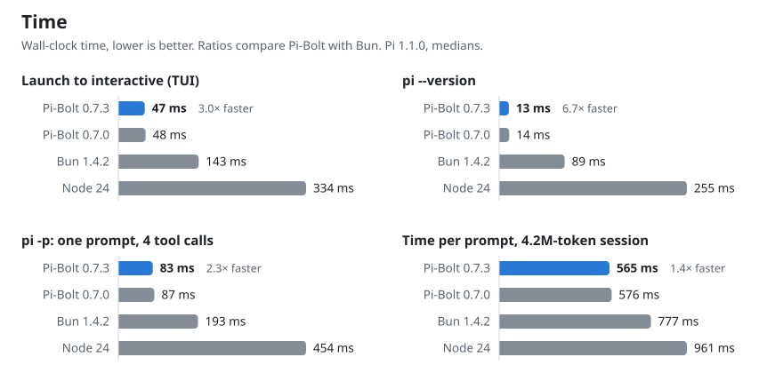
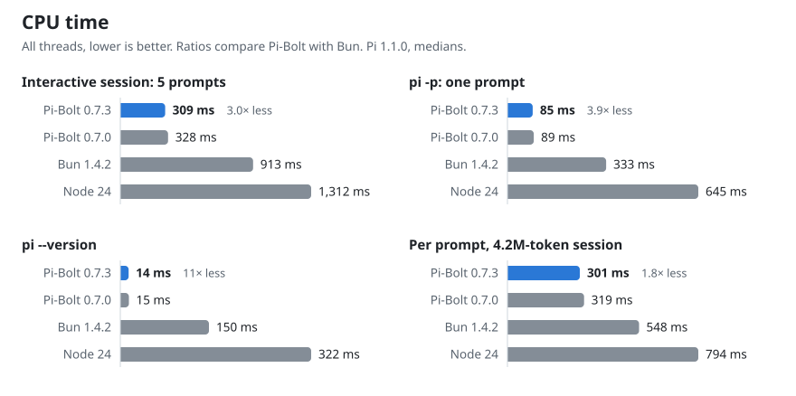
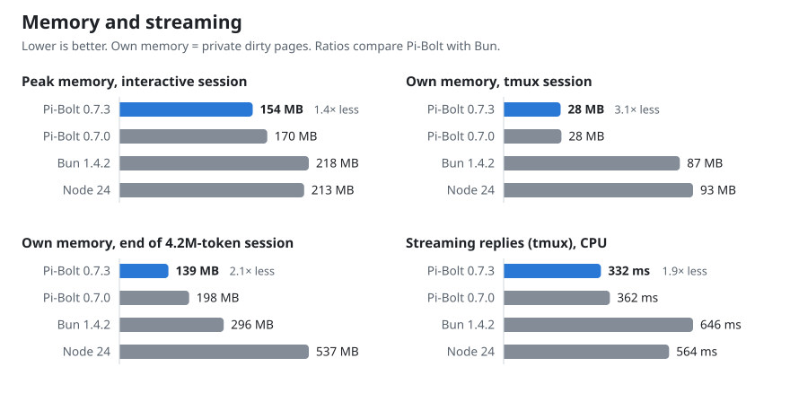
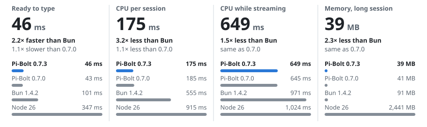
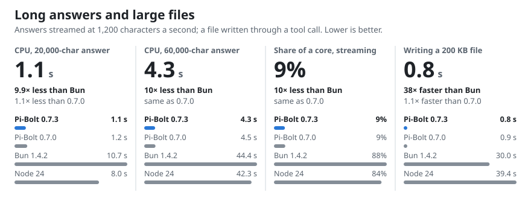
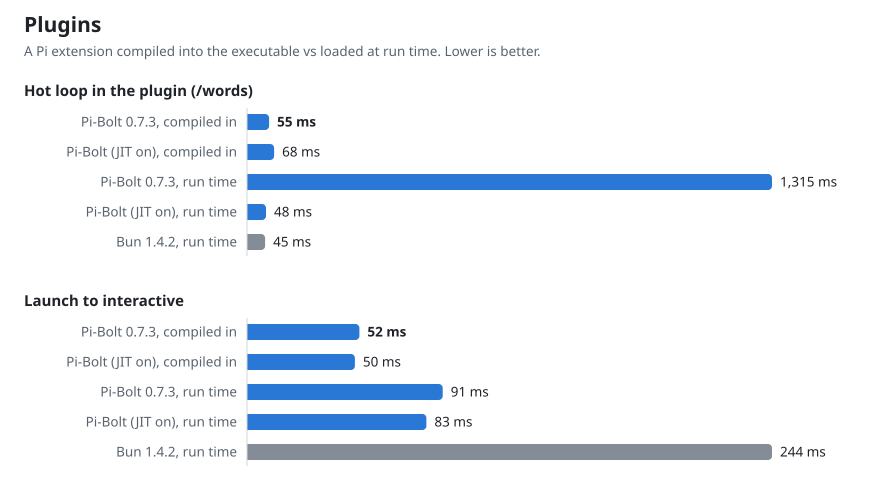

# Benchmarks

Pi-Bolt compared with the same Pi release on stock Bun and on Node.js. Every figure comes from the tools in
[`bench/`](../bench), and the raw results are in [`bench/results/`](../bench/results). The charts are drawn from those files by
[`bench/report.py`](../bench/report.py).

**Versions.** Pi-Bolt 0.7.3 (Pi 1.1.0) and 0.7.0 (Pi 1.0.3), against Pi 1.1.0 as released on stock Bun 1.4.2 and on Node, every
build installed from its release archive. [With a real model](#with-a-real-model) is an earlier measurement, of Pi-Bolt 0.6.1.

**These are measurements, not guarantees.** Each set of results comes from one machine: an AMD EPYC 7B13 server for Linux and an
M5 MacBook Air for macOS. On other hardware the milliseconds will differ, and so can the load, the terminal and the disk. What
carries over is the comparison, because every run interleaves the runtimes on the same machine: Pi-Bolt starts three times
sooner than Pi on Bun and uses about a third of its CPU over an interactive session. The ratio varies by scenario: see
each table.

- [0.7.3 against 0.7.2](#073-against-072)
- [Results](#results)
- [macOS on Apple silicon](#macos-on-apple-silicon)
- [With a real model](#with-a-real-model)
- [Setup and method](#setup-and-method)
- [In a real terminal (tmux)](#in-a-real-terminal-tmux)
  - [What Pi writes to the terminal](#what-pi-writes-to-the-terminal)
- [Long answers and large files](#long-answers-and-large-files)
- [Plugins](#plugins)
- [Questions](#questions)
  - [Why is a run-time plugin's loop slow on the default build?](#why-is-a-run-time-plugins-loop-slow-on-the-default-build)
- [Reproduce](#reproduce)
- [Correctness](#correctness)

## 0.7.3 against 0.7.2

What 0.7.3 changed, measured against 0.7.2 on the same machines, both installed from their release archives and interleaved.
Raw data and method: [`bench/results/2026-10-10-0.7.3-vs-0.7.2`](../bench/results/2026-10-10-0.7.3-vs-0.7.2). Medians;
"own memory" is the physical footprint on macOS and private dirty memory on Linux.

| Scenario | Metric | macOS 0.7.2 | macOS 0.7.3 | Linux 0.7.2 | Linux 0.7.3 |
|---|---|---:|---:|---:|---:|
| `pi -p`, `pi-bin` not in memory | wall | 177 ms | **64 ms** | | |
| `pi --version` | CPU | 7 ms | 7 ms | 16 ms | **15 ms** |
| | peak memory | 30 MB | 30 MB | 80 MB | **66 MB** |
| `pi -p` (one prompt, 5 turns) | CPU | 30 ms | 30 ms | 97 ms | **90 ms** |
| | peak footprint / peak memory | 32 MB | **29 MB** | 144 MB | **127 MB** |
| Interactive, 5 prompts | CPU | 131 ms | **125 ms** | 345 ms | **326 ms** |
| | peak footprint / peak memory | 51 MB | **46 MB** | 172 MB | **154 MB** |
| Long session, CPU per prompt | at prompt 70 / 50 | 73 ms | **63 ms** | 252 ms | **231 ms** |
| | own memory at 70 / 50 | 47-70 MB | **45-48 MB** | 115-157 MB | 129-160 MB |
| Streaming in tmux | CPU | 592 ms | **565 ms** | 408 ms | **363 ms** |
| Idle at the prompt | CPU per second | 1.0 ms | 1.1 ms | 0.56 ms | **0.30 ms** |
| 32 MB of command output, a line at a time | CPU | 2.0 s | **0.26 s** | 5.1 s | **1.7 s** |
| | peak memory | 104 MB | **56 MB** | 202 MB | **128 MB** |

Long-session memory moves with when the collector runs more than with the build: on Linux three runs of each gave 115-157 MB
for 0.7.2 and 129-160 MB for 0.7.3 at prompt 50, and mostly lower for 0.7.3 earlier in the session. In the 600-prompt soak of one RPC
session (`bench/stress.py`), the floor of memory stays flat on both platforms with 0.7.3 (macOS 24-25 MB; Linux 104-105 MB
resident), where 0.7.2's rose by 5 MB per 100 prompts on Linux (143-155 MB over 300 prompts).

## Results

<picture>
  <source media="(prefers-color-scheme: dark)" srcset="images/bench-speed-dark.svg">
  
</picture>

<picture>
  <source media="(prefers-color-scheme: dark)" srcset="images/bench-cpu-dark.svg">
  
</picture>

<picture>
  <source media="(prefers-color-scheme: dark)" srcset="images/bench-memory-dark.svg">
  
</picture>

Pi-Bolt 0.7.3 and 0.7.0 on Linux (AMD EPYC 7B13, pinned to four cores), against Pi 1.1.0 as released on stock Bun 1.4.2 and
on Node 24. Medians of 21 runs of each scenario (after 3 warm-up runs), 4 long sessions and 5 tmux rounds per build; raw data in
[`bench/results/2026-10-10-pi-bolt-0.7.3`](../bench/results/2026-10-10-pi-bolt-0.7.3), drawn by `bench/report.py`.

#### Time

|  | Pi-Bolt 0.7.3 | Pi-Bolt 0.7.0 | Bun 1.4.2 | Node 24 |
|---|---:|---:|---:|---:|
| Launch to interactive (TUI) | 47 ms | 48 ms | 143 ms | 334 ms |
| pi --version | 13 ms | 14 ms | 89 ms | 255 ms |
| pi -p: one prompt, 4 tool calls | 83 ms | 87 ms | 193 ms | 454 ms |
| Time per prompt, 4.2M-token session | 565 ms | 576 ms | 777 ms | 961 ms |

#### CPU

|  | Pi-Bolt 0.7.3 | Pi-Bolt 0.7.0 | Bun 1.4.2 | Node 24 |
|---|---:|---:|---:|---:|
| Interactive session: 5 prompts | 309 ms | 328 ms | 913 ms | 1,312 ms |
| pi -p: one prompt | 85 ms | 89 ms | 333 ms | 645 ms |
| pi --version | 14 ms | 15 ms | 150 ms | 322 ms |
| Per prompt, 4.2M-token session | 301 ms | 319 ms | 548 ms | 794 ms |

#### Memory and streaming

|  | Pi-Bolt 0.7.3 | Pi-Bolt 0.7.0 | Bun 1.4.2 | Node 24 |
|---|---:|---:|---:|---:|
| Peak memory, interactive session | 154 MB | 170 MB | 218 MB | 213 MB |
| Own memory, tmux session | 28 MB | 28 MB | 87 MB | 93 MB |
| Own memory, end of 4.2M-token session | 139 MB | 198 MB | 296 MB | 537 MB |
| Streaming replies (tmux), CPU | 332 ms | 362 ms | 646 ms | 564 ms |

## macOS on Apple silicon

The same tools on an Apple M5 MacBook Air (10 cores, 16 GB, macOS 27.0.1). macOS cannot pin processes to cores, so runs are
interleaved. "Own memory" and "peak footprint" are the physical footprint (what Activity Monitor shows), the closest measure to
private dirty pages on Linux; "peak memory" is the resident peak, which also counts clean pages of the executable and freed
memory the kernel may take back. The MacBook Air has no fan and other work ran on it, so differences under about 10% between
0.7.3 and 0.7.0 are within its noise.

<picture>
  <source media="(prefers-color-scheme: dark)" srcset="images/darwin-arm64/bench-hero-dark.svg">
  
</picture>

Pi-Bolt 0.7.3 and 0.7.0 against Pi 1.1.0 as released on Bun 1.4.2 and on Node 26.11 (21 runs, 4 long sessions and 5 tmux rounds
per build; raw data in [`bench/results/2026-10-10-darwin-arm64-0.7.3`](../bench/results/2026-10-10-darwin-arm64-0.7.3)):

#### Time

|  | Pi-Bolt 0.7.3 | Pi-Bolt 0.7.0 | Bun 1.4.2 | Node 26 |
|---|---:|---:|---:|---:|
| Launch to interactive (TUI) | 46 ms | 43 ms | 101 ms | 347 ms |
| pi --version | 20 ms | 18 ms | 59 ms | 291 ms |
| pi -p: one prompt, 4 tool calls | 64 ms | 64 ms | 122 ms | 412 ms |
| Time per prompt, 4.2M-token session | 344 ms | 354 ms | 497 ms | 613 ms |

#### CPU

|  | Pi-Bolt 0.7.3 | Pi-Bolt 0.7.0 | Bun 1.4.2 | Node 26 |
|---|---:|---:|---:|---:|
| Interactive session: 5 prompts | 175 ms | 185 ms | 555 ms | 915 ms |
| pi -p: one prompt | 58 ms | 59 ms | 236 ms | 525 ms |
| pi --version | 14 ms | 14 ms | 98 ms | 312 ms |
| Per prompt, 4.2M-token session | 136 ms | 154 ms | 320 ms | 516 ms |

#### Memory and streaming

|  | Pi-Bolt 0.7.3 | Pi-Bolt 0.7.0 | Bun 1.4.2 | Node 26 |
|---|---:|---:|---:|---:|
| Peak memory, interactive session | 100 MB | 105 MB | 208 MB | 230 MB |
| Own memory, tmux session | 25 MB | 24 MB | 68 MB | 152 MB |
| Own memory, end of 4.2M-token session | 39 MB | 41 MB | 91 MB | 2,441 MB |
| Streaming replies (tmux), CPU | 649 ms | 645 ms | 971 ms | 1,024 ms |

**What macOS adds at launch.** `pi` is a small launcher: it starts `pi-bin`, the Pi-Bolt executable, in the same process, and
forks the helper that starts the programs Pi runs ([ARCHITECTURE.md](ARCHITECTURE.md#the-macos-arm64-port)). The figures are of the
release builds, launcher included. The helper adds 0.3 ms to `pi -p` (1%; nothing to `pi --version`, which starts nothing), and
each program Pi starts takes 1.4 ms more to start and be waited for (`spawnSync` of `/usr/bin/true`: 2.1 ms against 0.7). None of
the scenarios above starts a program. The programs' CPU time is not counted in Pi's on macOS (`wait4` counts a process's
children; the programs are the helper's).

## Windows x64

The full suite (`bench\run-suite.ps1`) on Windows 11 25H2 (26200) on an Intel Core i5-1335U laptop (16 GB, on AC, best
performance, Defender real-time protection on): Pi-Bolt 0.7.0 from `2acfe5ca0` (the runtime `16ed51941` with ThinLTO and Control
Flow Guard, Pi compiled ahead of time for this CPU, JIT off; the executable that ships, after the hardening round of 2026-10-10),
Pi 1.0.3 as released on stock Bun 1.4.2, and Pi 1.0.3's npm package on Node 22.23.3 and Node 24.21.0. Medians of 11 runs (2
warm-up), 4 long sessions of 75 prompts, 5 streaming rounds; streaming runs in a ConPTY rather than tmux
(`bench\conpty_check.py`: ConPTY passes frames on at about 16 ms, which is the floor of the frame times). Raw data and charts:
[`bench/results/2026-10-10-windows`](../bench/results/2026-10-10-windows).

| | Pi-Bolt | Pi on Bun 1.4.2 | Node 22 | Node 24 |
|---|---:|---:|---:|---:|
| Launch to interactive (TUI) | **91 ms** | 178 ms | 346 ms | 312 ms |
| `pi --version` | **35 ms** | 100 ms | 262 ms | 233 ms |
| `pi -p`: one prompt, 4 tool calls | **124 ms** | 222 ms | 468 ms | 415 ms |
| Time per prompt, 4.2M-token session | **413 ms** | 514 ms | 821 ms | 804 ms |
| CPU, interactive session (5 prompts) | **296 ms** | 816 ms | 1,231 ms | 1,189 ms |
| CPU, `pi -p` | **101 ms** | 355 ms | 627 ms | 595 ms |
| CPU, `pi --version` | **18 ms** | 141 ms | 303 ms | 290 ms |
| CPU per prompt, 4.2M-token session | **188 ms** | 313 ms | 694 ms | 648 ms |
| Peak working set, interactive session | **96 MB** | 164 MB | 167 MB | 195 MB |
| Peak private working set, interactive session | **57 MB** | 126 MB | 134 MB | 153 MB |
| Peak private bytes (commit), interactive session | **114 MB** | 344 MB | 178 MB | 270 MB |
| Private working set, TUI streaming in a ConPTY | **33 MB** | 98 MB | 99 MB | 178 MB |
| Private working set, end of 4.2M-token session | **148 MB** | 230 MB | 376 MB | 423 MB |
| Private bytes, end of 4.2M-token session | **217 MB** | 437 MB | 421 MB | 471 MB |
| CPU, streaming replies (ConPTY) | **959 ms** | 1,116 ms | 1,613 ms | 1,420 ms |
| Frame time p99, streaming replies | **17 ms** | 17 ms | 20 ms | 20 ms |
| Frame time p99 / longest stall, 50 KB file written | **18 / 116 ms** | 47 / 1,946 ms | 35 / 1,303 ms | 61 / 915 ms |
| Frame time p99 / longest stall, 200 KB file written | **18 / 62 ms** | 124 / 26,515 ms | 46 / 54,249 ms | 75 / 43,644 ms |
| GC pause p99, 20,000-char answer / longest GC pause | 2.2 / **2.9 ms** | 4.2 / 29 ms | **1.1** / 3.8 ms | 1.6 / 9.2 ms |

Pi-Bolt is the fastest and uses the least memory in every row, commit included. The exception is the p99 GC pause, where
Node is shorter by about a millisecond; Pi-Bolt's longest pause is the shortest. This run was slower for every build than the
day before at `pi -p` and in streaming (Bun 222 against 202 ms, Node 22 468 against 435; the process floor 19 against 17): the
machine. An interleaved A/B of `pi -p` on this build and the one before, 11 rounds, gave 115 against 119 ms, and 94 against 95
ms of CPU. Against the suite of 2026-10-06 ([`bench/results/2026-10-06-windows-suite`](../bench/results/2026-10-06-windows-suite),
`7ec4e71f7`), on the same machine:
- Launch to interactive: 100 to 91 ms. CPU per prompt in the long session: 253 to 188 ms.
- Peak private bytes: 247 to 114 MB. Private bytes at the end of the long session: 370 to 217 MB.
- The longest GC pause: 8.3 to 2.9 ms.

The 2026-10-09 suite of the build before the hardening round is in
[`bench/results/2026-10-09-windows`](../bench/results/2026-10-09-windows).

These come from memory committed on demand, the prebuilt heap laid out in first-use order, and the runtime's code laid out in
the order it runs ([WINDOWS.md](WINDOWS.md)). Each 50 KB and 200 KB step ends with a `bash` tool call. The only `bash.exe` on
this machine is the WSL launcher with no distribution installed, which takes about 0.1 s to start and fail. That is Pi-Bolt's
longest stall of the 50 KB step, and every build pays it.

Plugins: the example plugin's hot loop takes 37 ms compiled into the executable (`build-pi.ps1 -Plugins`). Loaded at run time,
it takes 758 ms with the JIT off and 32 ms in the build with the JIT on, the same as on Bun.

### Earlier Windows results

The same scenarios on Windows 11 (26200) on an Intel Core i5-1335U laptop (16 GB, on AC, Defender real-time protection on),
against Pi 1.0.3 as released on Bun 1.4.2 and its npm package on Node 24.21. Pi-Bolt is the `windows-x64` branch: the runtime without
LTO yet, Pi compiled ahead of time with the JIT off for this CPU (`scripts\build-pi.ps1`). Processes run in Job objects of their own
and the TUI in a ConPTY (`bench/winproc.py`); CPU is the main process's, by cycles. "Peak memory" is the peak working set,
"peak private" the peak private bytes (commit charge). Medians of 11 runs (2 warm-up), interleaved. Raw data:
[`bench/results/2026-10-06-windows-aot`](../bench/results/2026-10-06-windows-aot), and before the compiled code
[`bench/results/2026-10-06-windows-baseline`](../bench/results/2026-10-06-windows-baseline).

| Scenario | Metric | Pi-Bolt | Pi-Bolt, bytecode | Pi (fork) on Bun 1.4.2 | Pi 1.0.3 on Bun 1.4.2 | Node 24 |
|---|---|---:|---:|---:|---:|---:|
| `pi --version` | wall | **44 ms** | 60 ms | 53 ms | 104 ms | 240 ms |
| | CPU | **29 ms** | 46 ms | 38 ms | 147 ms | 294 ms |
| `pi -p "<prompt>"`: 5 model turns, 4 tool calls | wall | **163 ms** | 220 ms | 205 ms | 258 ms | 491 ms |
| | CPU | **138 ms** | 314 ms | 289 ms | 425 ms | 701 ms |
| | peak memory | **83 MB** | 100 MB | 104 MB | 117 MB | 118 MB |
| Interactive TUI: launch, 5 prompts, `/quit` | time to interactive | **122 ms** | 159 ms | 153 ms | 191 ms | 359 ms |
| | CPU | **368 ms** | 752 ms | 723 ms | 887 ms | 1,302 ms |
| | peak memory | **113 MB** | 138 MB | 147 MB | 163 MB | 195 MB |
| | peak private | **241 MB** | 326 MB | 324 MB | 342 MB | 269 MB |

**What an executable costs Windows when it is not running.** Windows charges an image's uninitialized sections to the system's
commit for as long as it keeps the image cached, after the process has exited (process memory does not show it;
[WINDOWS.md](WINDOWS.md#what-was-measured)). `bench/image_commit.py`, medians of 5: Pi on Bun 1 MB; Pi-Bolt 33 MB (the 32 MB of the
region that has to be in the image); before that was fixed, 1,029 MB.


## With a real model

The tables above use a local scripted model, which answers instantly and the same way every time, so they measure Pi and its
runtime alone. These use a hosted model over the internet, with thinking at its highest setting, as in daily use. They were
taken with Pi-Bolt 0.6.1 against Pi 1.0.0 as released, and have not been taken again since.
- Pi loads the provider's extension, in its Bun build for Pi-Bolt and Bun and its Node build for Node.
- Every runtime gets the same prompts and a fresh copy of the same project, and the runtimes take turns.
- CPU and memory are those of Pi's own process.

A real model's answers differ from run to run in length and in the tools they call, so some figures are also given per 1,000
characters streamed (answer and thinking). With a real model, a turn's wall time is almost all the model's (its thinking and the
network), and it varies by several seconds from one request to the next.

### Linux

**A prompt with tools, `pi -p`:** "Use ls to list this folder (and src), read README.md, then tell me its first heading and how
many .ts files there are." 10 rounds per runtime.

| | Pi-Bolt | Bun 1.4.2 | Node 22 | Node 24 |
|---|---:|---:|---:|---:|
| Correct answers | 10/10 | 10/10 | 10/10 | 10/10 |
| Wall time, median | 7.96 s | 7.96 s | 8.17 s | 7.48 s |
| Wall time, fastest / slowest | 6.0 / 12.0 s | 6.3 / 9.4 s | 6.5 / 10.7 s | 6.0 / 10.2 s |
| **Pi's CPU, median** | **0.20 s** | 0.49 s | 0.77 s | 0.76 s |
| Pi's CPU, range | 0.17–0.23 s | 0.45–0.52 s | 0.69–0.89 s | 0.73–0.79 s |
| Peak memory, median | **124 MB** | 131 MB | 126 MB | 135 MB |

- **Wall time:** no runtime is faster or slower. In a permutation test, differences in median as large as these came out by
  chance 65–97% of the time: they are the model's variation.
- **CPU:** the difference does not overlap. Pi-Bolt's slowest run used less than Bun's fastest.

**A long answer, `pi -p`:** about 2,500 words of Markdown with three TypeScript code blocks, answered in the chat. One run per runtime.

| | Pi-Bolt | Bun 1.4.2 | Node 22 | Node 24 |
|---|---:|---:|---:|---:|
| Answer | 19,803 characters | 20,116 characters | 19,103 characters | 20,305 characters |
| Wall time | 51 s | 53 s | 40 s | 44 s |
| **Pi's CPU** | **0.47 s** | 0.91 s | 1.06 s | 1.06 s |
| Peak memory | **124 MB** | 129 MB | 125 MB | 137 MB |

**The interactive TUI in tmux:** a 160×48 pane, "read README.md and summarize it in two sentences". One run per runtime.

| | Pi-Bolt | Bun 1.4.2 | Node 22 | Node 24 |
|---|---:|---:|---:|---:|
| Time to interactive | **88 ms** | 192 ms | 389 ms | 388 ms |
| Answer on screen after | 5.2 s | 6.5 s | 6.8 s | 5.4 s |
| **Pi's CPU, launch to answer** | **0.20 s** | 0.64 s | 0.94 s | 0.89 s |

All answers correct; no errors on screen; `/quit` exited with 0 everywhere.

### macOS

On the M5, against Pi 1.0.0 as released on Bun 1.4.2 and on Node 26. Two rounds per runtime.

**A long answer, `pi -p`:** a technical article of about 1,500 words with headings, a table and two code blocks, without tools.

| | Pi-Bolt | Bun 1.4.2 | Node 26 |
|---|---:|---:|---:|
| Characters streamed (answer and thinking), the two runs | 31,478 / 23,748 | 20,004 / 15,294 | 20,744 / 23,981 |
| **Pi's CPU per 1,000 characters** | **19.1 / 18.7 ms** | 76.6 / 36.3 ms | 47.1 / 39.1 ms |
| Pi's CPU | **600 / 443 ms** | 1,532 / 555 ms | 978 / 938 ms |
| Peak footprint | **29 / 29 MB** | 161 / 75 MB | 115 / 110 MB |

**A long session in the fullscreen TUI:** five prompts in one session.
- In the first four, the model reads one of four large Pi source files (140, 239, 63 and 47 KB) and explains it in about 600 words.
- In the fifth, it writes a design review of all four, about 1,000 words.
- Each session took 11 to 22 tool calls, and the context grew to between 82,000 and 141,000 tokens.

| | Pi-Bolt | Bun 1.4.2 | Node 26 |
|---|---:|---:|---:|
| Time to interactive, with the provider's extension | **67 / 72 ms** | 96 / 95 ms | 222 / 235 ms |
| Characters streamed, the two sessions | 74,602 / 62,691 | 61,840 / 64,547 | 68,458 / 61,331 |
| **Pi's CPU, whole session** | **5.6 / 4.3 s** | 11.5 / 8.9 s | 10.1 / 8.0 s |
| Pi's CPU per 1,000 characters | **74 / 68 ms** | 183 / 136 ms | 142 / 125 ms |
| Own memory after the last prompt | **38 / 33 MB** | 105 / 97 MB | 163 / 162 MB |
| Peak footprint | **51 / 45 MB** | not recorded / 155 MB | 166 / 163 MB |

Every prompt ended normally on every runtime. Bun's first session did not exit in time for its peak to be read.

The user waits the same on every runtime: the model sets the pace. Pi-Bolt does that waiting with:
- 40–50% of the CPU of Pi on Bun and a quarter to a half of Node's;
- a third of Bun's memory, and less than a quarter of Node's.

The measurements are in [`bench/results/2026-10-04-darwin-arm64-0.6.1-real-model`](../bench/results/2026-10-04-darwin-arm64-0.6.1-real-model).

## Setup and method

| | |
|---|---|
| Pi | 1.1.0 (`v1.1.0`) |
| Linux machine | AMD EPYC 7B13 (Zen 3), Linux 7.0, every run pinned to the same 4 cores (the least busy of a shared VM) |
| macOS machine | Apple M5 MacBook Air, macOS 27.0.1, not pinned |
| **Pi-Bolt 0.7.3** and **0.7.0** | `pi-bolt-linux-x64` and `pi-bolt-darwin-arm64` from their releases: JIT off; 0.7.0 runs Pi 1.0.3 |
| **Bun 1.4.2** | Pi 1.1.0 as released (`scripts/prepare-pi.sh --tag v1.1.0`), built with `scripts/build-pi.sh --stable`: Pi's own `bun build --compile` command plus `--bytecode` |
| **Node 24.21** (Linux), **Node 26.11** (macOS) | Pi 1.1.0 as released: its npm bundle (`dist/bundle/cli.js`, with Node's compile cache) |

**The model.** A local server ([`bench/fake_model.py`](../bench/fake_model.py)) speaks the OpenAI chat-completions protocol and
streams a scripted conversation: for each prompt, four `read` tool calls on Pi source files, then an answer. There is no network
and no model latency, so the figures measure Pi and its runtime.

**Isolation.**

- Each run gets a fresh Pi home with only that model configured, and an environment cleared of `BUN_*`, `NODE_*` and `PI_*`.
- Runs are interleaved round-robin across builds, so background load affects all of them alike.

**Metrics.**

- **Wall**: elapsed time.
- **CPU**: user plus system time of all threads, from `wait4()` or the scheduler's per-thread statistics.
- **Peak memory**: maximum resident set.
- **Own memory**: private dirty pages (`smaps_rollup`). This is what a process costs beyond shared and file-backed pages, which
  matters for Pi-Bolt: its code and prebuilt heap are file-backed.

**The machine is shared.** It is a cloud VM that other heavy jobs also use. Interleaving keeps comparisons fair, but absolute
figures vary between sessions. Figures from sessions taken under heavy load were discarded and re-run.

## In a real terminal (tmux)

Pi in a 160×48 tmux pane ([`bench/tmux_check.py`](../bench/tmux_check.py)): keys sent with `send-keys`, the screen read back
with `capture-pane`, and the model streaming at human pace, one event every 10 ms.

| | Pi-Bolt 0.7.3 | Pi-Bolt 0.7.0 | Bun 1.4.2 | Node 24 |
|---|---:|---:|---:|---:|
| time to interactive | **62 ms** | 69 ms | 168 ms | 383 ms |
| keystroke to screen, median | 5.3 ms | 5.6 ms | 5.5 ms | 5.6 ms |
| 20 KB paste | **6.0 ms** | 6.0 ms | 10.7 ms | 6.6 ms |
| **CPU while a reply streams** (6.5 s; median of 4) | **332 ms** | 362 ms | 646 ms | 564 ms |
| written to the terminal for a reply | **140 KB** | 136 KB | 324 KB | 324 KB |
| idle CPU at the prompt | **0.1 ms/s** | 0.5 ms/s | 1.8 ms/s | 31 ms/s |
| own memory, start → end | **17 → 28 MB** | 16 → 28 MB | 60 → 87 MB | 67 → 93 MB |
| resize while streaming, Escape to abort, prompt after abort, `/quit`, errors on screen | all ok, none | all ok, none | all ok, none | all ok, none |

Linux, medians of 5 rounds of 4 prompts each. Keystroke latency is the terminal's own round trip and is the same everywhere.
Pi-Bolt uses half of Bun's CPU while replies stream and a third of its private memory. On the Mac the same rounds gave Pi-Bolt
0.7.3 649 ms of CPU while replies stream (0.7.0: 645 ms, Bun 971 ms, Node 1,024 ms) and 20 → 25 MB of own memory (Bun 65 → 68 MB,
Node 82 → 152 MB); raw data in the results folders.

### What Pi writes to the terminal

Everything Pi writes, tmux parses and draws again for its client, and an ssh connection or `docker exec` carries.
[`bench/tmux_load.py`](../bench/tmux_load.py) runs Pi in a tmux pane with a client attached while a 20,000-character Markdown
answer streams in at 1,200 characters a second:

| | Pi-Bolt 0.7.3 | Pi-Bolt 0.7.0 | Bun 1.4.2 | Node 24 |
|---|---:|---:|---:|---:|
| Pi writes to the pane | **529 KB** | 529 KB | 3,571 KB | 3,583 KB |
| tmux sends its client | **282 KB** | 282 KB | 1,426 KB | 1,432 KB |
| CPU of the tmux server | **0.21 s** | 0.19 s | 0.85 s | 0.82 s |
| CPU of Pi | **1.15 s** | 1.10 s | 12.18 s | 9.75 s |

In fullscreen mode, Pi's default, a line added to the transcript moves every row of the screen, and Pi writes every row again.
Pi-Bolt (from 0.5.2) scrolls the rows that only moved, with a scroll region and line feeds, and draws what differs afterwards.
What the screen shows is the same: [`bench/e2e_fullscreen.py`](../bench/e2e_fullscreen.py) compares every screen, text and
colors, with and without it, in tmux and in zmx, also inside a container. `PI_TUI_SCROLL_ROWS=0` turns it off. One run on
Linux ([`tmux_load.txt`](../bench/results/2026-10-10-pi-bolt-0.7.3/tmux_load.txt)).

## Long answers and large files

<picture>
  <source media="(prefers-color-scheme: dark)" srcset="images/bench-long-dark.svg">
  
</picture>

| | Pi-Bolt 0.7.3 | Pi-Bolt 0.7.0 | Bun 1.4.2 | Node 24 |
|---|---:|---:|---:|---:|
| Streaming a 20,000-character answer: CPU | **1.1 s** | 1.2 s | 10.7 s | 8.0 s |
| Streaming a 60,000-character answer: CPU | **4.3 s** | 4.5 s | 44.4 s | 42.3 s |
| Share of a core while it streams (60,000 characters) | **9%** | 9% | 88% | 84% |
| Writing a 200 KB file through a tool call (`pi -p`) | **0.8 s** | 0.9 s | 30.0 s | 39.4 s |
| Writing a 200 KB file through a tool call: CPU | **0.5 s** | 0.5 s | 43.3 s | 40.0 s |

On the Mac: streaming a 60,000-character answer took 7.0 s of CPU (0.7.0: 6.6 s, Bun 38.4 s, Node 37.8 s), and writing a 200 KB
file 0.5 s (Bun 22.1 s, Node 26.6 s).

`bench/long_answer.py` streams Markdown answers (headings, lists, code blocks in several languages, tables) into the TUI at 1,200
characters a second, 24 at a time, and measures the CPU Pi uses until the answer has been drawn. `bench/large_write.py` has the
model write a file of TypeScript through the `write` tool, its arguments streaming 16 characters at a time (about one token),
and measures `pi -p` from start to exit. Means of two runs on Linux, pinned to 4 cores. Bun and Node run Pi 1.1.0 as released.

Both come from Pi's own code, not from the runtime. Pi draws a message again each time a few more words arrive, with a new
component that lexes the whole Markdown text, renders and wraps every block and highlights every code block, so the cost of each
redraw grows with the length of the answer. Pi-Bolt keeps what it lexed and rendered, and does again only the last two blocks
(where a block ends depends on the line after it); highlighted code is kept by language and text. What is drawn is the same, line
for line and color for color (`bench/e2e_screen.py`). Pi also parses all of a tool call's arguments each time a few more
characters arrive; Pi-Bolt parses them again only once they have grown by an eighth while they stream, and in full when the call
is complete. And Pi highlights every line of a file being written, and all of it again on every redraw once it is complete;
Pi-Bolt highlights the lines a collapsed call shows, and the rest when the call is expanded.

## Plugins

The example plugin ([`examples/plugins`](../examples/plugins)): a `/words` command that counts the words of a 16.8 MB file in a
character loop, timed inside Pi with `performance.now()`. See [PLUGINS.md](PLUGINS.md).

<picture>
  <source media="(prefers-color-scheme: dark)" srcset="images/bench-plugins-dark.svg">
  
</picture>

| How the plugin runs | Launch to interactive | `/words` hot loop |
|---|---:|---:|
| **Compiled in**, Pi-Bolt (default, JIT off) | 52 ms | 55 ms |
| Compiled in, Pi-Bolt JIT on | **50 ms** | 68 ms |
| Loaded at run time, Pi-Bolt JIT off (interpreted) | 91 ms | 1,315 ms |
| Loaded at run time, Pi-Bolt JIT on | 83 ms | 48 ms |
| Loaded at run time, Bun 1.4.2 | 244 ms | **45 ms** |

Linux, medians of 5 sessions, each running `/words` 5 times, Pi-Bolt 0.7.3. The hot-loop figure is the median of runs 2–5.

## Questions

### Why is a run-time plugin's loop slow on the default build?

Because that plugin's code is not compiled at all on that build: it runs in JavaScriptCore's bytecode interpreter.

- The default Pi-Bolt executable runs with the **JIT off**. Pi's own code does not need a JIT: all of it was compiled to machine
  code when the executable was built.
- A plugin loaded at **run time** (from `~/.pi/agent/extensions`, a project's `.pi/extensions` or a Pi package) is not part of
  that build. `jiti` turns its TypeScript into JavaScript when Pi starts. With no JIT, JavaScriptCore can then only interpret
  it, and an interpreter runs a tight loop 20–30× slower than compiled code.
- Stock Bun's JIT compiles the loop after a few thousand iterations, which is how it gets to 45 ms.

This is not a regression. The figure is the same in every Pi-Bolt release: it is the cost of loading code at run time into a
runtime with no JIT. There are two ways around it:

| | Plugin hot loop |
|---|---:|
| Compile the plugin in: `scripts/build-pi.sh --plugins` ([PLUGINS.md](PLUGINS.md)) | 55 ms, and nothing measurable at launch instead of 39 ms |
| Use the JIT-on build (`pi-bolt-linux-x64-jit`) and keep loading it at run time | 48 ms after warm-up (Bun: 45 ms) |
| Load it at run time on the default (JIT-off) build | 1,315 ms |

## Reproduce

```bash
scripts/package-release.sh                      # out/pi-bolt, out/pi-bolt-baseline, out/pi-bolt-jit
scripts/build-pi.sh --plugins examples/plugins/plugins.ts --out out/pi-bolt-plugins
scripts/build-pi.sh --plugins examples/plugins/plugins.ts --jit on --out out/pi-bolt-plugins-jit
scripts/prepare-pi.sh --tag v1.1.0 --dir ../pi-1.1.0                              # Pi as released
scripts/build-pi.sh --stable --pi ../pi-1.1.0 --out out/pi-stable-upstream
PIBOLT_PI=../pi-1.1.0 PIBOLT_STABLE_PI=out/pi-stable-upstream/pi PIBOLT_COMPARE="pi-bolt-0.7.0=<0.7.0's pi>" \
	bench/run-suite.sh bench/results/my-run --cpus 8-15   # about an hour; then charts and tables from bench/report.py
B="--cpus 8-15 --build pi-bolt=out/pi-bolt/pi --build bun=out/pi-stable-upstream/pi"
python3 bench/long_answer.py $B --sizes 20000,60000
python3 bench/large_write.py $B --sizes 50,200
python3 bench/tmux_load.py $B --steps md:20000
```

Each tool also runs on its own, with any builds given as `--build name=command`. See [`bench/README.md`](../bench/README.md).

## Correctness

Speed is only measured on builds that pass the correctness checks:

- `bench/e2e_tools.py`: every Pi tool, with output and files byte-identical to stock Bun's.
- `bench/ui_check.py` and `bench/tmux_check.py`: the TUI.
- `tests/aot/run.sh`: engine tests, and `tests/aot/fuzz/run.sh`: random programs compiled ahead of time must print what they
  print as bytecode.
- JavaScriptCore's own stress tests, run with and without AOT compilation: 4,779 of the 4,786 that run behave the same. The 7
  that differ inspect JIT internals that do not exist without a JIT.

See [BUILDING.md](BUILDING.md#tests).
